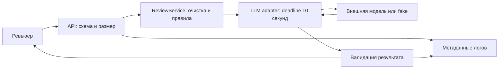

# ADR: решение для первого рабочего сценария

- Статус: proposed.
- Дата: 2026-09-22.
- Ответственные: автор учебной работы; утверждение человеком ещё не выполнено.

## Контекст

Нужно выполнить [SEC-1, API-1, REL-1, OUT-1 и OBS-1](context.md#факты-и-правила) при анализе одного diff. Учебный patch показывает API и сервис, но не адаптер и middleware. Их текущее поведение неизвестно.

## Решение

Предлагается синхронный API с выделенным адаптером LLM и внедряемой зависимостью fake LLM для тестов. Последовательность: валидация JSON и размера исходного diff → очистка секретов с сохранением строк → prompt с отделёнными недоверенными данными → вызов с общим deadline 10 секунд и без retry → проверка JSON-схемы → ответ человеку.

Контракт ошибок и типов определён в [Context Pack](context.md#формат-входа-и-результата). Не обрезать вход для обхода лимита. Ошибочный ответ модели не исправлять молча и не выдавать как успешный. Структура и координаты evidence проверяются программно, смысл замечания - человеком; автоматическая схема не гарантирует QA-1.

Логи содержат только request_id, duration_ms и status. Middleware доступа и провайдерский SDK также должны быть настроены без тел запросов/ответов и exception dump с prompt. request_id генерируется сервисом. В MVP diff не сохраняется на диск. Эти решения относятся к будущей реализации.

## Рассмотренные альтернативы

| Альтернатива | Почему не выбрали сейчас |
|---|---|
| Прямой LLM-вызов внутри endpoint | Сложнее изолировать очистку, deadline и fake LLM |
| API + отдельный сервис + адаптер | Выбран: отдельные проверяемые границы, достаточно для одного запроса |
| Очередь и фоновый worker | Пока нет требования на долгие задания; усложняет статусы и хранение diff |

## Последствия и главный риск

- Плюсы: повторяемые тесты без платного провайдера; предсказуемая ошибка; смена модели через адаптер.
- Ограничения: 10 секунд могут быть недостаточны для реального провайдера; это нужно измерить отдельно.
- Главный риск: неизвестный секрет может не распознаться; prompt injection и ложные замечания остаются возможны.
- Проверка: синтетические секреты, недоверенные инструкции в diff, экспертная оценка evidence. Не обещать абсолютной защиты экранированием.

## Архитектурная схема

## Как использовали AI

Запрос с контекстом: [P1-03](prompts.md#p1-03). Сравнены три варианта архитектуры; отмечены ограничения детектора секретов.
