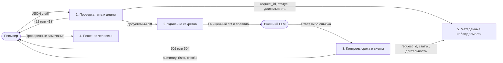

# Анализ процесса: AS IS и TO BE

## AS IS

Рабочая гипотеза: автор передаёт diff → ревьюер читает его вручную или задаёт общий вопрос LLM → перепроверяет каждый совет → принимает решение. Потери времени возникают при поиске подтверждений и проверке догадок модели. В двух сохранённых ответах видны такие догадки; длительность процесса не измерена.

## TO BE

DFD уровня 1: прямоугольники обозначают процессы, внешние участники - скруглённые узлы, стрелки подписаны передаваемыми данными. Mermaid используется как средство изображения DFD. Хранилища diff не вводятся.

## Разница

| Что меняется | AS IS | TO BE | Как проверим изменение |
|---|---|---|---|
| Доказательства | Общие советы и догадки | Не более трёх замечаний с привязкой к diff/правилу | Экспертная разметка, [метрики](problem.md#метрики) |
| Передача секретов | В учебном diff строка передаётся прямо в prompt | Перед моделью отдельная очистка | Fake LLM фиксирует только синтетический prompt |
| Ошибка провайдера | В показанном методе нет локальной обработки | Ограниченный срок и контролируемый ответ | Сценарии REL-1 |
| Решение | Человек | Человек | Нет GitHub write-вызовов |

Это проектная схема, а не описание развёрнутой системы. Валидация схемы не доказывает смысловую корректность риска; окончательная проверка остаётся человеку.

## Как использовали AI

Запрос с контекстом: [P1-03](prompts.md#p1-03). Схема сопоставлена с SEC-1, API-1, REL-1 и OBS-1.
