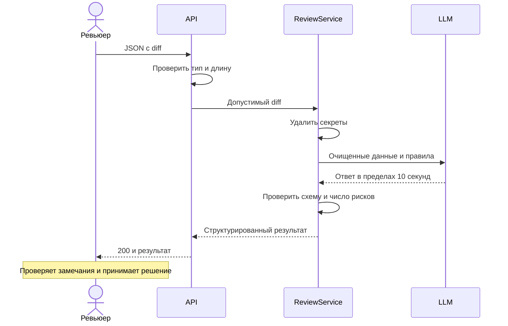

# Use cases и user stories

## Первый рабочий сценарий

**Когда** ревьюер передаёт diff одного PR, **система** проверяет вход, удаляет секреты и запрашивает LLM, **а пользователь получает** не более трёх проверяемых замечаний или контролируемую ошибку.

Не входят: самостоятельная загрузка приватного репозитория, изменение кода, approve/merge и публикация ответа в GitHub.

## Use case

| Поле | Значение |
|---|---|
| Актор | Ревьюер |
| Триггер | Отправлен POST /api/reviews |
| Предусловия | Пользователь имеет право передать diff; адаптер LLM настроен в будущем прототипе |
| Основной результат | summary, risks, checks; решение принимает пользователь |
| Ошибка или отказ | 422 неверный вход; 413 превышен размер; 504 timeout; 502 ошибка/невалидный ответ модели |



## User stories и acceptance criteria

| ID | История | Критерий приёмки |
|---|---|---|
| US-1 | Как ревьюер, хочу список доказанных рисков, чтобы быстро их проверить | summary/risks/checks; 0-3 риска; обязательные поля; эксперт может найти evidence |
| US-2 | Как автор diff, хочу удалить секреты до внешней передачи | Синтетические токен, пароль и приватный ключ заменены до вызова fake LLM; тело не попало в логи |
| US-3 | Как пользователь, хочу понятный отказ для плохого входа | 422 для отсутствующего diff или неверного типа; 413 для 20 001 символа; LLM не вызывается |
| US-4 | Как пользователь, хочу ограниченное ожидание | Вызов прекращается по deadline 10 секунд; 504 при timeout; 502 при ошибке провайдера/схемы |

```gherkin
Feature: Советы по одному diff
  Scenario: Позитивный
    Given валидный diff без секретов и fake LLM с корректным JSON
    When пользователь отправляет POST /api/reviews
    Then ответ имеет статус 200 и поля summary, risks, checks
    And risks содержит не больше трёх элементов с file, line, evidence, risk

  Scenario: Превышение длины
    Given diff содержит 20001 Unicode code points
    When пользователь отправляет POST /api/reviews
    Then ответ имеет статус 413
    And LLM не вызывается

  Scenario: Допустимая граница
    Given diff содержит 20000 Unicode code points и fake LLM готов вернуть корректный JSON
    When пользователь отправляет POST /api/reviews
    Then запрос проходит проверку размера и вызывает LLM ровно один раз

  Scenario: Недоступная модель
    Given fake LLM не отвечает до deadline 10 секунд
    When пользователь отправляет допустимый diff
    Then API возвращает 504 с error.code llm_timeout и request_id
    And повторный вызов LLM не выполняется
```

## Definition of Ready и Definition of Done

DoR: для истории указаны источник требования, вход, ожидаемый статус, негативный случай и fake LLM; спорные проектные решения помечены.

DoD будущей реализации: соответствующие unit/integration/E2E-проверки пройдены, контракт и логи проверены, человек выполнил ревью. DoD этой домашки: согласованные документы, master prompt и журнал запросов. Тесты сервиса не запускались, backend ещё нет.

## Как использовали AI

Запрос с контекстом: [P1-03](prompts.md#p1-03). Для историй заданы входы, ожидаемые ответы и граничные случаи.
