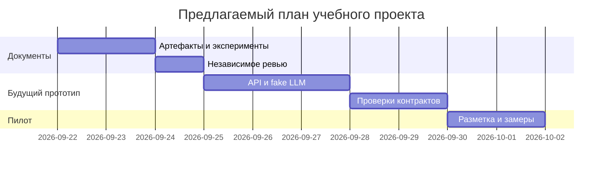

# План поставки

## Инкременты и ответственность

| Инкремент | Наблюдаемый результат | Что делает человек | Что делает AI или субагент | Проверка | Зависимости |
|---|---|---|---|---|---|
| 1. Документы | Контекст, истории, ADR, планы тестов | Проверяет требования и допущения | Черновик и проверка требований | make test и содержательная сверка | [Правила кейса](context.md#факты-и-правила) |
| 2. Будущий прототип | API с fake LLM, очисткой и deadline | Реализует/принимает код | Помогает написать код и тесты по отдельной задаче | Unit и integration из планов | Утверждённый контракт |
| 3. Будущий пилот | Оценка времени и качества на синтетическом наборе | Делает независимую разметку и решает о запуске | Готовит сводку измерений | E2E, нагрузочные пределы, метрики | Прототип и доступ к провайдеру |

В текущую работу входит инкремент 1. Реализация сервиса и пилот запланированы отдельно.

## Диаграмма Ганта

Даты предварительные; сроки преподавателя не заданы.

## Как использовали AI

Запрос с контекстом: [P1-03](prompts.md#p1-03). Подготовка документов отделена от будущей реализации и пилота.
